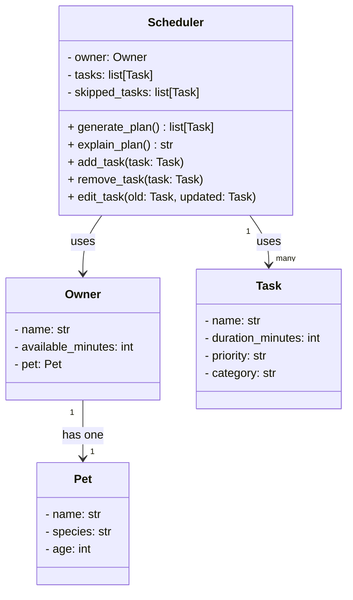

# PawPal+ UML Design

## Class Diagram (Mermaid)



## Class Diagram (ASCII)

```
┌─────────────────────────────┐
│            Pet              │
│  Represents the animal      │
│  being cared for            │
├─────────────────────────────┤
│ - name: str                 │
│ - species: str              │
│ - age: int                  │
└─────────────────────────────┘
          △ has one
          │
┌─────────────────────────────┐
│           Owner             │
│  The person using the app.  │
│  Defines the time budget    │
│  available for care tasks   │
├─────────────────────────────┤
│ - name: str                 │
│ - available_minutes: int    │
│ - pet: Pet                  │
└─────────────────────────────┘
          │ passed into
          ▼
┌─────────────────────────────┐       ┌─────────────────────────────┐
│         Scheduler           │ uses  │            Task             │
│  Core logic class.          │──────▶│  A single pet care          │
│  Takes the owner and task   │       │  activity with duration     │
│  list and produces a        │       │  and priority               │
│  filtered, prioritized plan │       ├─────────────────────────────┤
├─────────────────────────────┤       │ - name: str                 │
│ - owner: Owner              │       │ - duration_minutes: int     │
│ - tasks: list[Task]         │       │ - priority: str             │
│ - skipped_tasks: list[Task] │       │   (high / medium / low)     │
├─────────────────────────────┤       │ - category: str             │
│ + generate_plan(): list     │       │   (walk, feeding, meds,     │
│   [Task]                    │       │    grooming, etc.)          │
│ + explain_plan(): str       │       └─────────────────────────────┘
│ + add_task(task: Task)      │
│ + remove_task(task: Task)   │
│ + edit_task(old: Task,      │
│     updated: Task)          │
└─────────────────────────────┘
```

## Relationships

- **Owner has one Pet** — the owner's pet is the subject of all care tasks
- **Scheduler uses Owner** — reads `available_minutes` to constrain the plan
- **Scheduler uses Task[]** — filters and sorts tasks to build the final plan

## Scheduling Logic (generate_plan)

1. Filter out tasks whose `duration_minutes` exceeds remaining time
2. Sort remaining tasks by priority (high → medium → low)
3. Greedily add tasks until `available_minutes` is exhausted
4. Store any tasks that didn't fit in `skipped_tasks`
5. Return the selected tasks as an ordered list

## Explanation Logic (explain_plan)

- For each task in the plan, state why it was included (priority + duration fit)
- For each task in `skipped_tasks`, state why it was excluded (e.g., "not enough time remaining")
- Returns a human-readable string suitable for display in the UI
